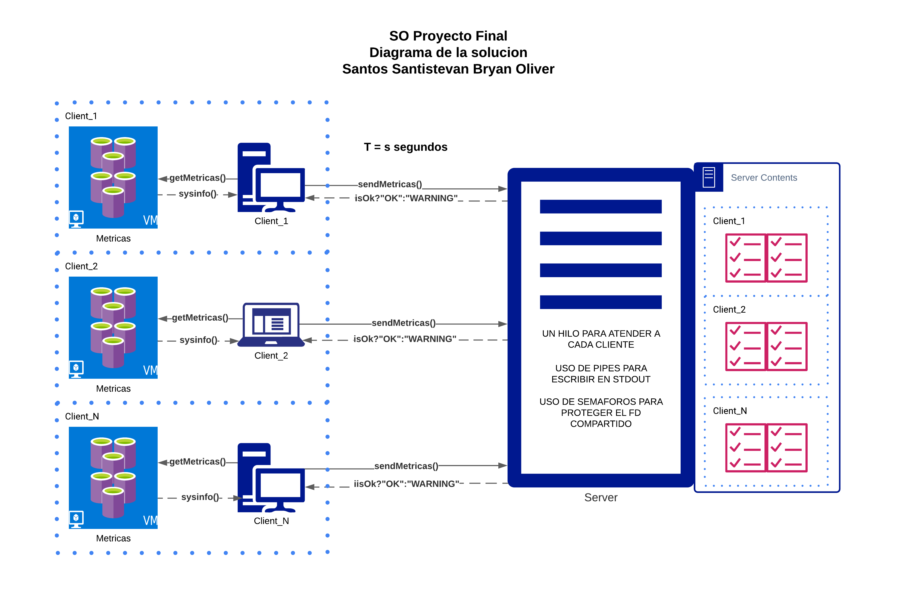

# SO_proy2_2021_1S
Se requiere implementar una versión en modo texto de una solución de monitoreo
en tiempo real de métricas de varios sistemas GNU/Linux.

1. Existirán N clientes que enviarán diversas métricas de sus sistemas al
servidor.
2. Cada mensaje contendrá diversas métricas de un sistema en un tiempo
determinado.
3. Definir mínimo 6 métricas a recolectar por sistema. Ejm: % de espacio
usado y disponible de la memoria principal, secundaria, % de uso de la CPU,
etc.
4. Considerar definir diversas alertas (mínimo 2) que al superar un threshold
pueda enviar un mensaje vía mensaje Whatsapp (Sugerencia API Twilio).

## Ejemplo de Solucion: [Prometheus combinado con Grafana](https://tinyurl.com/demoPrometheus)

## Diagrama de la solucion propuesta

## Explicacion del codigo

### Alerta via SMS

#### Preparando el uso de Twilio Messaging API

1. Registrarse en Twilio y obtener una FreeAccount.
2. Habilitar el SMS desde la consola y obtener el phone number, SID y AUTH_TOKEN.
3. Instalar Twilio CLI, se recomienda tener la ultima version estable de NodeJS.
4. Hacer login con `twilio login`, necesitaremos el:
- Account SID
- Auth Token
- Setear un nickname (recordarlo)
- Setear un password (recordarla)
5. Podemos comprar ($0.50) un phone-number con sms habilitado, en caso de no haberlo hecho antes, podemos hacerlo de dos maneras:
- Desde twilio.com/console en la seccion Dashboard la opcion "get a phone number"
- Por comando `twilio phone-numbers:buy:local --country-code CC --sms-enabled`
> Donde [CC](https://en.wikipedia.org/wiki/ISO_3166-1_alpha-2) es el codigo del pais por ejemplo Ecuador:EC, Estados Unidos:US, etc.
6. Como estamos en un SO Linux asumiremos que contamos con PHP. Entonces podemos verificar la version con `php --version`. En caso de no tenerlo se puede instalar o usar otro de los lenguajes de programacion que se muestran en [1].
7. Dirigirnos al wd del proyecto y descargar [Twilio PHP Helper Library](https://github.com/twilio/twilio-php/archive/main.zip), luego descomprimirlo.

#### Codigo en send_sms.php 

Se debe actualizar las funciones de curl con el comando `sudo apt-get install php7.0-curl`.
Los SMS solo se podran enviar a [Verified Caller IDs](https://www.twilio.com/console/phone-numbers/verified), podemos agregar algunos numeros, en este caso hice pruebas con mi numero personal, el que se ingresa al registrar.

## Video del funcionamiento

> [Uso del MonLog by BOSS](https://www.youtube.com/watch?v=c5K3NQ08IQI)

## Bibliografia

> [1] [Twilio docs](https://www.twilio.com/docs/usage/tutorials/how-to-use-your-free-trial-account)
> [2] [Journalctl docs](https://www.loggly.com/ultimate-guide/using-journalctl/)
> [3] [Example of Parsing Arguments with getopt](https://www.gnu.org/software/libc/manual/html_node/Example-of-Getopt.html)